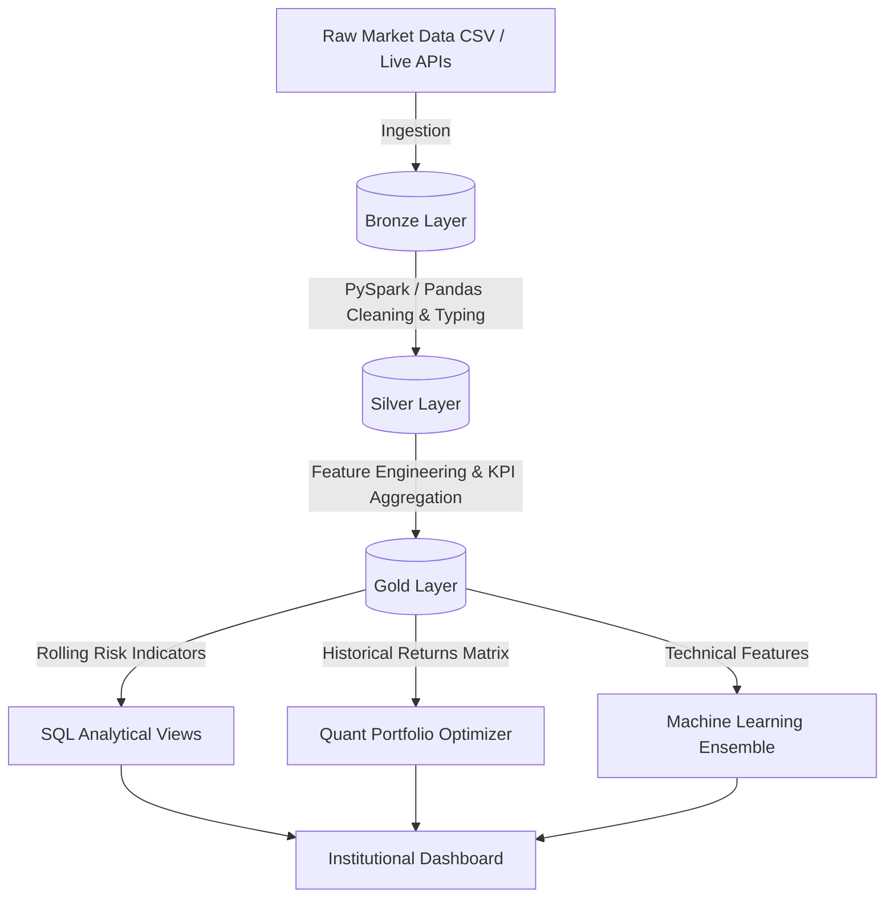
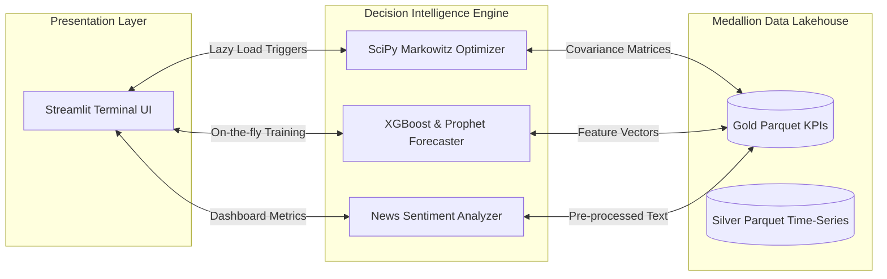

# Global Financial Market Intelligence Platform


The **Global Financial Market Intelligence Platform** is a high-end, institutional-grade quantitative analytics system designed to simulate the capabilities of an enterprise research workstation. 

By leveraging a **Medallion Data Lakehouse Architecture**, advanced **Ensemble Machine Learning**, and **Quantitative Portfolio Optimization**, the platform transforms raw market data into actionable, decision-intelligence insights.

---

## 🌟 Elite Features & Capabilities

### 📈 1. Quantitative Portfolio Optimization
Moves beyond simple analytics into true decision-intelligence:
*   **Markowitz Efficient Frontier**: Uses `scipy.optimize` to mathematically calculate the optimal allocation of capital across top-performing assets, maximizing the Sharpe Ratio.
*   **Stochastic Monte Carlo Simulations**: Runs 1,000+ simulated future market paths to project 1-year portfolio growth, automatically calculating the 95% Value at Risk (VaR) and downside probability.

### 🤖 2. Explainable AI Forecasting
A robust "Super Ensemble" prediction engine loaded dynamically:
*   **Prophet Time-Series**: Models daily seasonality and long-term trends for 30-day projection signals.
*   **XGBoost Supervised Learning**: Predicts next-day close prices based on rolling technical indicators (RSI, Volatility, MACD).
*   **Model Decision Engine**: Features built-in ML explainability via Feature Importance charts, proving exactly *why* the model is making its buy/sell recommendations.
*   **Lazy Loading**: Models are dynamically trained and cached in-memory the moment an asset is requested, ensuring the UI remains blazing fast.

### 🏗️ 3. Medallion Data Engineering Architecture
Built for scale and production readiness:
*   **Bronze -> Silver -> Gold Pipelines**: Raw data ingestion is cleaned, normalized, and heavily aggregated into analytical views.
*   **PySpark / Pandas Fallback**: Engineered to utilize PySpark for distributed processing of massive datasets, with seamless automated fallbacks to Pandas if Spark environments are unavailable.
*   **Advanced SQL Analytics**: Exposes real-world window functions and CTEs inside the `sql/` directory (e.g., rolling volatility, sector momentum ranking).

### 💼 4. Institutional Visual Design
*   **Morning Executive Briefing**: A default landing page serving a live "Morning Brief" with macro summaries, top anomaly alerts, and a real-time data freshness timestamp.
*   **Live Market Sync**: Integrates with `yfinance` via a "Sync Live Market Data" button to pull real-time market prints directly into the historical Data Lakehouse context.
*   **Bloomberg-Style UI**: A premium, "glassmorphism" dark theme built on Streamlit with smooth micro-animations and responsive layouts.
*   **Executive Insight Engine**: An automated sidebar that continuously parses the data to provide qualitative text warnings on market volatility, breadth, and sentiment momentum.

---

## 🛠️ Technology Stack

*   **Data Engineering**: PySpark, Pandas, Parquet, Advanced SQL
*   **Machine Learning**: Scikit-Learn, XGBoost, Facebook Prophet
*   **Quantitative Math**: NumPy, SciPy (Optimization)
*   **Live Data APIs**: `yfinance`
*   **Frontend / Visualization**: Streamlit, Plotly Express, Plotly Graph Objects
*   **Backend Support**: FastAPI (Endpoint Infrastructure)

---

## 📂 Project Architecture

### Directory Structure
```text
global-financial-market-intelligence-platform/
├── data/
│   ├── bronze/     (Raw CSVs, unstructured text)
│   ├── silver/     (Cleaned, typed Parquet files)
│   └── gold/       (Business-level aggregated KPIs, Portfolios)
├── pipelines/
│   └── transformations/ (PySpark Medallion ETL scripts)
├── sql/
│   ├── rolling_volatility.sql        (Window functions & risk)
│   ├── sector_momentum_ranking.sql   (Asset weighting logic)
│   └── anomaly_detection.sql         (Z-score spike detection)
├── models/
│   ├── forecasting/     (Prophet & XGBoost training scripts)
│   └── anomaly_detection/ (Z-score volatility spike detection)
├── dashboard/
│   └── streamlit/
│       └── app.py       (Main UI / Quant Engine Application)
├── DASHBOARD_WORKFLOW.md  (Detailed documentation of UI capabilities)
└── README.md
```

### Data Pipeline Flow (Medallion Architecture)


### System Architecture


---

## 🚀 Getting Started

### 1. Environment Setup
```bash
# Clone the repository
git clone https://github.com/yourusername/global-financial-market-intelligence-platform.git
cd global-financial-market-intelligence-platform

# Install requirements
pip install -r requirements.txt
```

### 2. Run the Data Pipeline
Run the main orchestrator to process data from Bronze to Gold layer:
```bash
python main.py
```

### 3. Launch the Institutional Terminal
Start the Streamlit UI to interact with the quant models:
```bash
python -m streamlit run dashboard/streamlit/app.py
```

---

