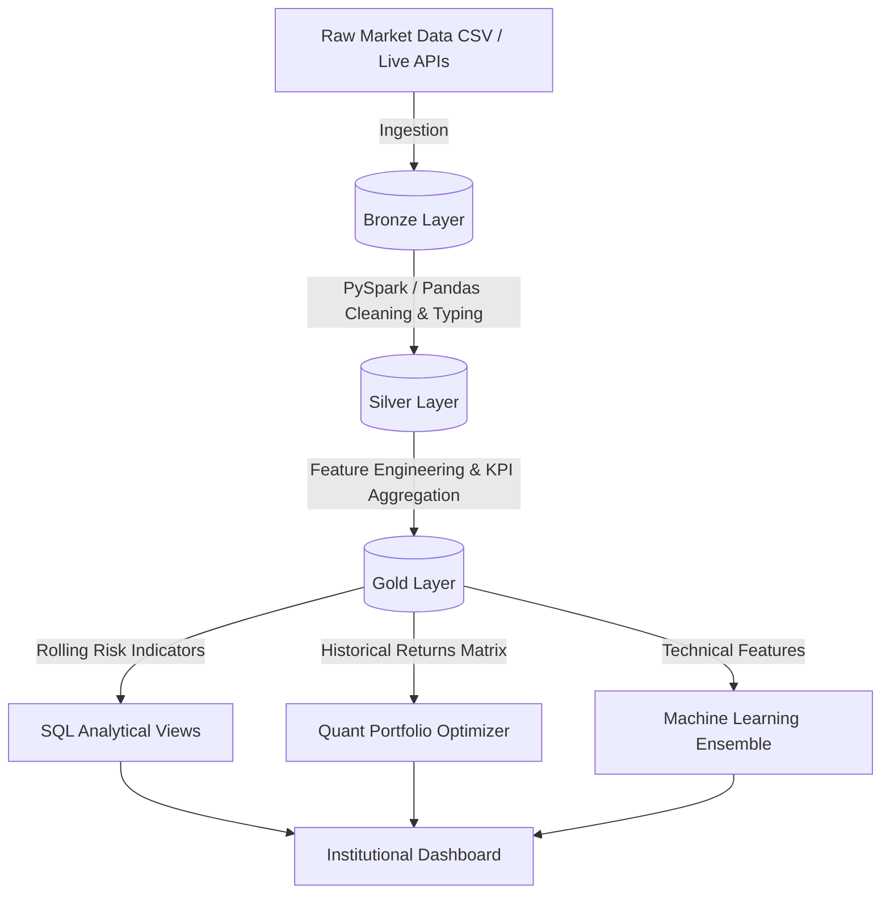
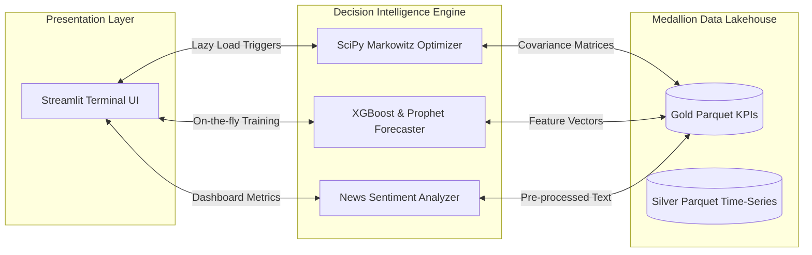

# Global Financial Market Intelligence Platform


The **Global Financial Market Intelligence Platform** is a high-end, institutional-grade quantitative analytics system designed to simulate the capabilities of an enterprise research workstation. The entire frontend is proudly **deployed using Streamlit**, providing a blazing-fast, responsive, and beautifully designed user interface.

### 🎯 Core Objectives
*   **Democratize Quantitative Finance**: Provide retail investors and analysts with institutional-grade tools (e.g., Markowitz Optimization, Monte Carlo Simulations) typically reserved for elite hedge funds.
*   **Unify Disparate Data Streams**: Seamlessly integrate and analyze traditional equities, cryptocurrencies, macroeconomic sentiment, and fundamental data in one cohesive environment.
*   **Provide Actionable Intelligence**: Move beyond static charts by implementing explainable AI that generates concrete, data-backed buy/sell signals and risk assessments.

### 🚀 Technical Goals
*   Implement a robust, scalable **Medallion Data Architecture** (Bronze, Silver, Gold) capable of processing massive datasets using PySpark and Advanced SQL.
*   Build a "Super Ensemble" Machine Learning engine utilizing Prophet and XGBoost for dynamic, on-the-fly time-series forecasting.
*   Ensure lightning-fast UI responsiveness by leveraging lazy loading, caching, and efficient vectorized operations via NumPy and Pandas.

By leveraging a **Medallion Data Lakehouse Architecture**, advanced **Ensemble Machine Learning**, and **Quantitative Portfolio Optimization**, the platform transforms raw market data into actionable, decision-intelligence insights.

---

## 📸 Dashboard Previews


---


## 🌟 Elite Features & Capabilities

### 📈 1. Quantitative Portfolio Optimization
Moves beyond simple analytics into true decision-intelligence:
*   **Markowitz Efficient Frontier**: Uses `scipy.optimize` to mathematically calculate the optimal allocation of capital across top-performing assets, maximizing the Sharpe Ratio.
*   **Stochastic Monte Carlo Simulations**: Runs 1,000+ simulated future market paths to project 1-year portfolio growth, automatically calculating the 95% Value at Risk (VaR) and downside probability.

### 🤖 2. Explainable AI Forecasting
A robust "Super Ensemble" prediction engine loaded dynamically:
*   **Prophet Time-Series**: Models daily seasonality and long-term trends for 30-day projection signals.
*   **XGBoost Supervised Learning**: Predicts next-day close prices based on rolling technical indicators (RSI, Volatility, MACD).
*   **Model Decision Engine**: Features built-in ML explainability via Feature Importance charts, proving exactly *why* the model is making its buy/sell recommendations.
*   **Lazy Loading**: Models are dynamically trained and cached in-memory the moment an asset is requested, ensuring the UI remains blazing fast.

### 🏗️ 3. Medallion Data Engineering Architecture
Built for scale and production readiness:
*   **Bronze -> Silver -> Gold Pipelines**: Raw data ingestion is cleaned, normalized, and heavily aggregated into analytical views.
*   **PySpark / Pandas Fallback**: Engineered to utilize PySpark for distributed processing of massive datasets, with seamless automated fallbacks to Pandas if Spark environments are unavailable.
*   **Advanced SQL Analytics**: Exposes real-world window functions and CTEs inside the `sql/` directory (e.g., rolling volatility, sector momentum ranking).

### 💼 4. Institutional Visual Design
*   **Morning Executive Briefing**: A default landing page serving a live "Morning Brief" with macro summaries, top anomaly alerts, and a real-time data freshness timestamp.
*   **Live Market Sync**: Integrates with `yfinance` via a "Sync Live Market Data" button to pull real-time market prints directly into the historical Data Lakehouse context.
*   **Bloomberg-Style UI**: A premium, "glassmorphism" dark theme built on Streamlit with smooth micro-animations and responsive layouts.
*   **Executive Insight Engine**: An automated sidebar that continuously parses the data to provide qualitative text warnings on market volatility, breadth, and sentiment momentum.

---

## 📊 Datasets Used

The platform ingests and processes multiple robust datasets to form a comprehensive macro and micro financial view. These raw files reside in the `data/bronze/` layer before being systematically processed through the Medallion architecture.

1. **S&P 500 Historical Stock Data (`all_stocks_5yr.csv`)**
   * **Source**: [Kaggle - S&P 500 stock data](https://www.kaggle.com/datasets/camnugent/sandp500)
   * **Content**: 5 years of daily historical price action (Open, High, Low, Close, Volume) for top S&P 500 equities.
   * **Usage**: Forms the core backbone of technical indicator engineering, quantitative portfolio optimization (Markowitz), and base feature sets for the XGBoost/Prophet forecasting engines.

2. **Cryptocurrency Historical Prices (`crypto_prices.csv`)**
   * **Source**: [Kaggle - Cryptocurrency Historical Prices](https://www.kaggle.com/datasets/sudalairajkumar/cryptocurrencypricehistory)
   * **Content**: Daily historical price records and market data for major cryptocurrencies.
   * **Usage**: Provides alternative asset class data to analyze cross-asset correlations, extending the platform's analytical capabilities beyond traditional equities.

3. **Financial News Sentiment Data (`all-data.csv`)**
   * **Source**: [Kaggle - Sentiment Analysis for Financial News](https://www.kaggle.com/datasets/ankurzing/sentiment-analysis-for-financial-news)
   * **Content**: Thousands of financial news headlines labeled with qualitative sentiment (Positive, Negative, Neutral).
   * **Usage**: Enables the parsing of market sentiment, providing a contextual narrative to raw price action that is integrated directly into the dashboard's Executive Insight Engine.

4. **Company Fundamentals (`fundamentals.csv`)**
   * **Source**: [Kaggle - New York Stock Exchange (Fundamentals)](https://www.kaggle.com/datasets/dgawlik/nyse)
   * **Content**: Key corporate financial metrics, earnings data, and basic structural information.
   * **Usage**: Ingested to allow the cross-referencing of fundamental health against technical momentum, providing a more holistic view of asset valuation.

---

## 🛠️ Technology Stack

*   **Data Engineering**: PySpark, Pandas, Parquet, Advanced SQL
*   **Machine Learning**: Scikit-Learn, XGBoost, Facebook Prophet
*   **Quantitative Math**: NumPy, SciPy (Optimization)
*   **Live Data APIs**: `yfinance`
*   **Frontend / Visualization**: Streamlit, Plotly Express, Plotly Graph Objects
*   **Backend Support**: FastAPI (Endpoint Infrastructure)

---

## 📂 Project Architecture

### Directory Structure
```text
global-financial-market-intelligence-platform/
├── data/
│   ├── bronze/     (Raw CSVs, unstructured text)
│   ├── silver/     (Cleaned, typed Parquet files)
│   └── gold/       (Business-level aggregated KPIs, Portfolios)
├── pipelines/
│   └── transformations/ (PySpark Medallion ETL scripts)
├── sql/
│   ├── rolling_volatility.sql        (Window functions & risk)
│   ├── sector_momentum_ranking.sql   (Asset weighting logic)
│   └── anomaly_detection.sql         (Z-score spike detection)
├── models/
│   ├── forecasting/     (Prophet & XGBoost training scripts)
│   └── anomaly_detection/ (Z-score volatility spike detection)
├── dashboard/
│   └── streamlit/
│       └── app.py       (Main UI / Quant Engine Application)
├── DASHBOARD_WORKFLOW.md  (Detailed documentation of UI capabilities)
└── README.md
```

### 🏛️ Medallion Architecture Overview

The platform strictly adheres to the Databricks Medallion Data Lakehouse design pattern, ensuring that data is progressively refined, validated, and optimized for high-performance quantitative analytics.

*   **🥉 Bronze Layer (Raw & Immutable)**
    *   **Purpose**: Acts as the centralized landing zone for raw, unstructured or semi-structured data (e.g., CSV datasets, API JSON payloads). 
    *   **Process**: Data is ingested directly without any modification or schema enforcement, preserving the original state as a reliable historical source of truth.

*   **🥈 Silver Layer (Cleansed & Conformed)**
    *   **Purpose**: Creates a filtered, standardized, and highly performant data foundation.
    *   **Process**: Utilizes distributed PySpark pipelines (with robust Pandas fallbacks) to process Bronze data. It enforces strict data typing, handles missing values, normalizes date structures, and standardizes schemas. 
    *   **Storage**: The refined data is written to disk as highly compressed, columnar Parquet files (`.parquet`), drastically reducing downstream I/O latency.

*   **🥇 Gold Layer (Curated & Aggregated)**
    *   **Purpose**: Delivers business-ready data structures tailored specifically for the UI and ML engines.
    *   **Process**: Silver tables are joined and heavily aggregated. This layer computes complex financial metrics—such as rolling volatilities, 50/200-day moving averages, sector momentum rankings, and historical return covariance matrices. 
    *   **Storage**: The output consists of specialized Parquet files that are immediately ready for low-latency consumption by the Streamlit dashboard, SciPy Quantitative Optimizer, and ML forecasting models.

### Data Pipeline Flow


---

### System Architecture


---

### 🔄 System Workflow

The end-to-end operation of the platform follows a streamlined, automated workflow designed for maximum efficiency:

1.  **Data Orchestration**: The centralized `main.py` script acts as the primary orchestrator. It triggers the ETL pipelines, cascading data sequentially from the Bronze layer through to the final Gold layer.
2.  **Model Serialization**: Once the Gold data is generated, the orchestrator triggers the machine learning pipelines. The XGBoost anomaly detection and Prophet forecasting models are trained on the latest technical features and saved as serialized `.joblib` artifacts for rapid downstream loading.
3.  **Application Initialization**: The user launches the Streamlit dashboard (`app.py`). Upon initialization, the application seamlessly loads the highly-compressed Gold layer Parquet files and the serialized ML models into system memory.
4.  **Interactive Analytics & Inference**: As the user navigates the platform (e.g., analyzing a specific stock or building a portfolio), the application performs lightning-fast data retrieval. It executes on-the-fly portfolio optimization algorithms (Markowitz) and generates instant AI forecasts without requiring expensive re-computation.
5.  **Live Market Syncing**: Users can dynamically update their analytical context by triggering the live `yfinance` integration within the UI. This action fetches the latest market prints and merges them with the historical data lake in real-time, instantly refreshing all dashboard insights.

---

## 🚀 Getting Started

### 1. Environment Setup
```bash
# Clone the repository
git clone https://github.com/yourusername/global-financial-market-intelligence-platform.git
cd global-financial-market-intelligence-platform

# Ensure that the dataset files are correctly placed in data/bronze/
# (e.g., all_stocks_5yr.csv, crypto_prices.csv, all-data.csv, fundamentals.csv)

# Install requirements
pip install -r requirements.txt
```

### 2. Run the Data Pipeline
Run the main orchestrator to process data from Bronze to Gold layer:
```bash
python main.py
```

### 3. Launch the Institutional Terminal
Start the Streamlit UI to interact with the quant models:
```bash
python -m streamlit run dashboard/streamlit/app.py
```

---

